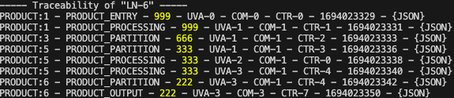
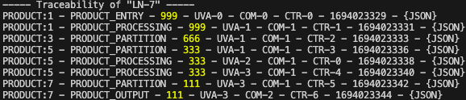
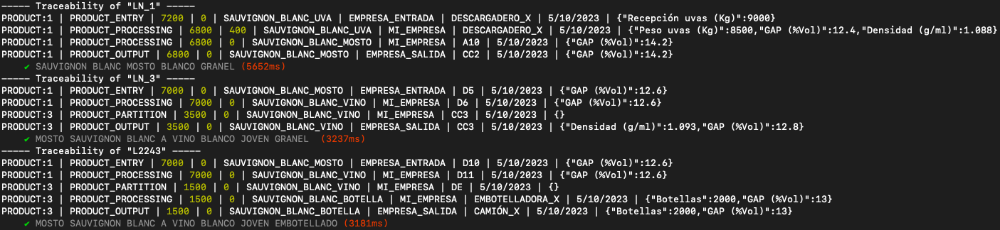

# Proyecto INVINOS

Traceability of the wine value chain is necessary to avoid counterfeiting, adulteration or excessive use of
preservatives, fertilizers or pesticides. The wine industry needs a system that guarantees the origin and traceability
of the product to allow the end consumer to verify the composition and the entire production process from grape picking
to consumption at the table, in order to ensure the authenticity of each bottle of wine offered to the consumer.
Blockchain technology can help the wine industry to guarantee the authenticity and provenance of wine in order to
improve its positioning and reputation.

One of the main objectives offered by Invinos is to guarantee the veracity of the information. With the digital passport
it will be possible to tell the stories about its origin and product processes, convey the message of good practices and
respect for the environment. It connects wine with people.

The objective of the project is the design and development of a traceability system based on blockchain, for the
automatic traceability of wine (D.O. certification, wine origin, composition, etc). It is a monitoring system for
monitoring system of parameters (temperature, humidity, hours of sunlight to which the grapes have been subjected during
its cultivation, etc.). the grapes during cultivation, etc.) as well as measuring parameters during the winemaking and
storage process. storage of the wine. Data that will be recorded in blockchain to provide information to both the end
user and the wine provider.

## Ejemplo de trazabilidad:

          PRODUCT:1(999)
            /       \
           /         \
          /           \
    PRODUCT:2(333) PRODUCT:3(666)
                    /       \
                   /         \
                  /           \
          PRODUCT:4(333) PRODUCT:5(333)
                           /       \
                          /         \
                         /           \
                 PRODUCT:6(222) PRODUCT:7(111)

Número de lote de PRODUCT:6 --> "LN-6"

Número de lote de PRODUCT:7 --> "LN-7"

## Líneas simples de trazabilidad:

## Cuestiones a debatir:

- ID de producto a utilizar y a enviar a nuestra API?
- Gestión de EOAs en la API o en el cliente?
- Un mismo número de lote se utilizará para varios IDs de producto?
